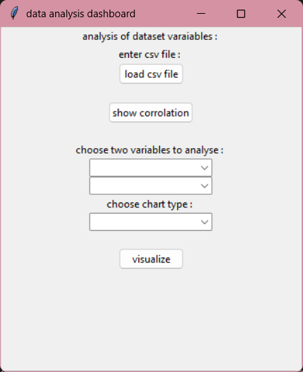
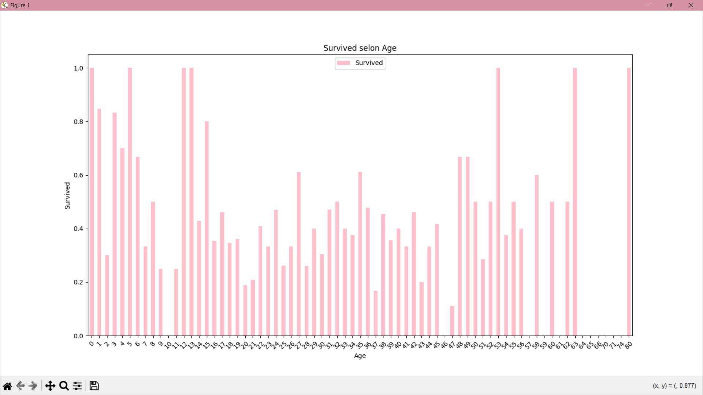

# Data Analysis Dashboard

A Python-based application that enables users to analyze datasets by visualizing relationships between variables using various chart types. The application is built with Tkinter for the graphical user interface and leverages libraries like Pandas, Matplotlib, and Seaborn for data processing and visualization.

## Features

- Load and analyze CSV datasets.
- Clean data by handling missing values and removing duplicates.
- Visualize relationships between variables using:
  - Line Plots
  - Bar Charts
  - Histograms
  - Scatter Plots
  - Pie Charts
  - Box Plots
- Display a correlation heatmap to show relationships between numerical variables.

## Technologies Used

- **Python**: Core programming language.
- **Tkinter**: GUI development.
- **Pandas**: Data manipulation and analysis.
- **Matplotlib**: Visualization.
- **Seaborn**: Heatmaps for correlation.

## Screenshots

### 1. Main Interface

### 2. Visualization Example

